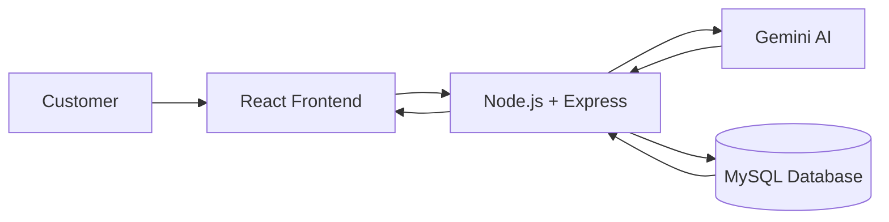
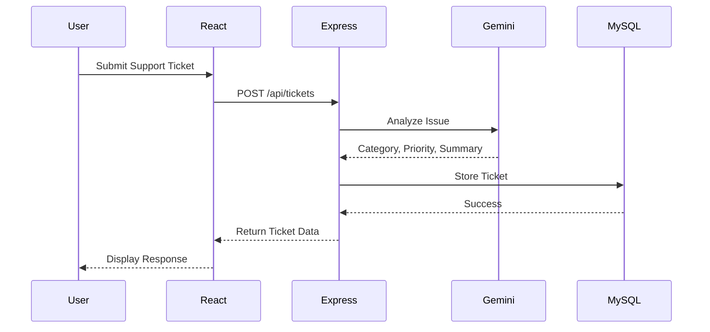

# Architecture Overview

## Introduction

The AI-Powered Support Ticket Analyzer follows a three-tier architecture consisting of the Presentation Layer, Application Layer, and Data Layer. This separation makes the application modular, maintainable, and scalable.

---

## High-Level Architecture

---

## Components

### 1. Frontend (React)

The frontend provides the user interface where customers can:

- Create a support ticket
- View all submitted tickets
- View ticket details

Axios is used to communicate with the backend through REST APIs.

---

### 2. Backend (Node.js & Express)

The backend contains the application's business logic. It is responsible for:

- Receiving API requests
- Validating user input
- Sending ticket descriptions to Gemini AI
- Receiving AI-generated results
- Saving tickets into MySQL
- Returning responses to the frontend

The backend is organized into:

- Routes
- Controllers
- Services
- Models
- Configuration

---

### 3. Gemini AI

Gemini analyzes the customer's issue and generates:

- Ticket Category
- Ticket Priority
- Ticket Summary

These AI-generated values are returned to the backend before storing the ticket.

---

### 4. Database (MySQL)

The MySQL database stores all processed support tickets.

Each ticket contains:

- Customer Name
- Email
- Issue Description
- AI Category
- AI Priority
- AI Summary
- Created Date

---

## Request Flow

---

## Design Decisions

- **React** was chosen for building a responsive component-based user interface.
- **Express.js** provides a lightweight and efficient REST API.
- **MySQL** offers reliable relational data storage.
- **Gemini AI** automates ticket analysis by generating category, priority, and summary.
- **Axios** simplifies communication between the frontend and backend.

---

## Overall Workflow

1. Customer submits a support ticket.
2. React sends the request to the Express backend.
3. The backend forwards the issue to Gemini AI.
4. Gemini returns the category, priority, and summary.
5. The backend stores the complete ticket in MySQL.
6. The backend returns the stored ticket to the frontend.
7. The frontend displays the result to the user.